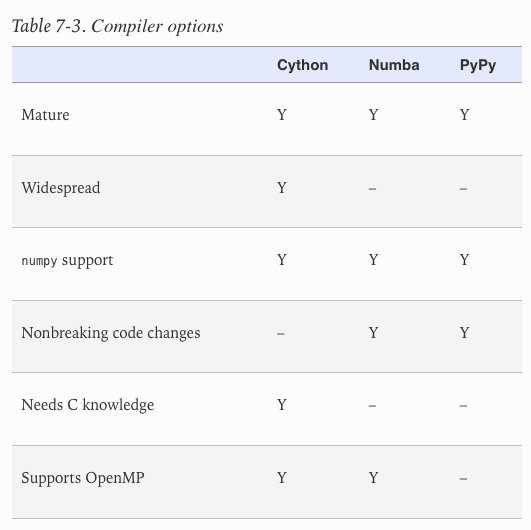

# My notes on some books I read on Python

- High performance Python: Practical Performant Programming for Humans - Micha Gorelick, Ian Ozsvald [[open notes]](./high-performance-python/notes.md)

- Fluent Python - Luciano Ramalho

