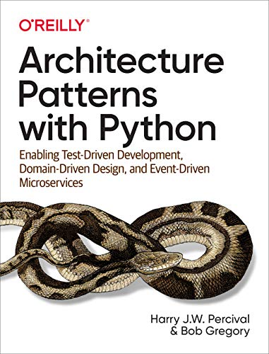

# Architecture Patterns with Python: Enabling Test-Driven Development, Domain-Driven Design, and Event-Driven Microservices

Authors: Bob Gregory, Harry Percival

[Available here](https://www.cosmicpython.com/)

# Introduction

> A big ball of mud is the natural state of software in the same way that wilderness is the natural state of your garden. It takes energy and direction to prevent the colapse

## Encapsulation and Abstractions
Encapsulating behavior by using abstractions is a powerful tool for making code more:
- expressive
- testable
- easier to maintain

> **Responsibility-driven design**: uses the words *roles* and *responsibilities* rather than *tasks*. Think about code in terms of behavior, rather than in terms of data or algorithms

## Layering
- When one function, module, or object uses another, we say that the one *depends on* the other. These dependencies form a kind of network or graph
- **Layered architecture**: divide the code into discrete categories or roles, and introduce rules about which categories of code can call each other

## Dependency Inversion Principle (DIP)
Formal definition:
1. High-level modules should not depend on low-level modules. Both should depend on abstractions
2. Abstractions should not depend on details. Instead, details should depend on abstractions

> *Depends on* doesn't mean *imports* or *calls*, necessarily, but rather a more general idea that one module *knows about* or *needs* another module

# Part I. Building an architecture to support domain modeling
