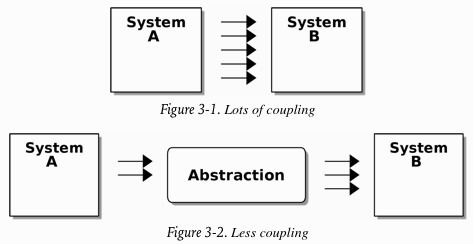

# Architecture Patterns with Python: Enabling Test-Driven Development, Domain-Driven Design, and Event-Driven Microservices

Authors: Bob Gregory, Harry Percival

[Available here](https://www.cosmicpython.com/)

- [Architecture Patterns with Python: Enabling Test-Driven Development, Domain-Driven Design, and Event-Driven Microservices](#architecture-patterns-with-python-enabling-test-driven-development-domain-driven-design-and-event-driven-microservices)
- [Introduction](#introduction)
  - [Encapsulation and Abstractions](#encapsulation-and-abstractions)
  - [Layering](#layering)
  - [Dependency Inversion Principle (DIP)](#dependency-inversion-principle-dip)
- [Part I. Building an architecture to support domain modeling](#part-i-building-an-architecture-to-support-domain-modeling)
- [Ch1. Domain Modeling](#ch1-domain-modeling)
  - [What is a domain model?](#what-is-a-domain-model)
    - [Dataclasses are great for value objects](#dataclasses-are-great-for-value-objects)
    - [Value objects and entities](#value-objects-and-entities)
- [Ch2. Repository Pattern](#ch2-repository-pattern)
  - [Object-relational mappers (ORMs)](#object-relational-mappers-orms)
  - [Introducing the repository pattern](#introducing-the-repository-pattern)
  - [What is the trade-off?](#what-is-the-trade-off)
- [Ch3. A brief interlude: on coupling and abstractions](#ch3-a-brief-interlude-on-coupling-and-abstractions)
- [Ch4. Our first use case: flask API and service layer](#ch4-our-first-use-case-flask-api-and-service-layer)
  - [A typical service function](#a-typical-service-function)
  - [Service Layer vs Domain Service](#service-layer-vs-domain-service)
- [Ch5. TDD in high gear and low gear](#ch5-tdd-in-high-gear-and-low-gear)
  - [High and low gear](#high-and-low-gear)
- [Ch6. Unit of Work pattern](#ch6-unit-of-work-pattern)
- [Ch7. Aggregates and consistency boundaries](#ch7-aggregates-and-consistency-boundaries)
  - [Why not just run everything in a spreadsheet?](#why-not-just-run-everything-in-a-spreadsheet)
  - [Invariants, constraints and consistency](#invariants-constraints-and-consistency)
  - [What is an Aggregate?](#what-is-an-aggregate)
  - [Choosing an Aggregate](#choosing-an-aggregate)
  - [One Aggregate = One Repository](#one-aggregate--one-repository)
  - [Optimistic concurrency](#optimistic-concurrency)
- [Part II. Event-Driven Architecture](#part-ii-event-driven-architecture)

# Introduction

> A big ball of mud is the natural state of software in the same way that wilderness is the natural state of your garden. It takes energy and direction to prevent the colapse

## Encapsulation and Abstractions
Encapsulating behavior by using abstractions is a powerful tool for making code more:
- expressive
- testable
- easier to maintain

> **Responsibility-driven design**: uses the words *roles* and *responsibilities* rather than *tasks*. Think about code in terms of behavior, rather than in terms of data or algorithms

## Layering
- When one function, module, or object uses another, we say that the one *depends on* the other. These dependencies form a kind of network or graph
- **Layered architecture**: divide the code into discrete categories or roles, and introduce rules about which categories of code can call each other

## Dependency Inversion Principle (DIP)
Formal definition:
1. High-level modules should not depend on low-level modules. Both should depend on abstractions
2. Abstractions should not depend on details. Instead, details should depend on abstractions

> *Depends on* doesn't mean *imports* or *calls*, necessarily, but rather a more general idea that one module *knows about* or *needs* another module

# Part I. Building an architecture to support domain modeling

> "Behavior should come first and drive our storage requirements."

# Ch1. Domain Modeling
## What is a domain model?
- Domain model = business logic layer
- Domain: "The problem you're trying to solve"
- Model: a map of a process or phenomenon that captures a useful property

> **Domain-driven design (DDD)**: the most important thing about software is that it provides a useful model of a problem. If we get that model right, our software delivers value and makes new things possible

- Make sure to express rules in the business jargon (*ubiquitous language* in DDD terminology)
- "We could show this code to our nontechnical coworkers, and they would agree that this correctly describes the behavior of the system"
- Avoiding a ball of mud: stick rigidly to principles of encapsulation and careful layering
- `from typing import NewType`: wrap primitive types

### Dataclasses are great for value objects
- Business concept that has data but no identity: choose to represent it using the *Value Object* pattern
- *Value Object*: any domain object that is uniquely identified by the data it holds (we usually make them immutable) -> `from dataclasses import dataclass`; `@dataclass(frozen=True)` decorator above class definition
- Dataclasses (or namedtuples) give us *value equality*

### Value objects and entities
- Value object: any object that is identified only by its data and doesn't have a long-lived identity
- Entity: domain object that has long-lived identity
- Entities, unlike values, have *identity equality*: we can change their values, and they are still recognizably the same thing -> make this explicit in code by implementing `__eq__` (equality operator) on entities
- `__hash__` is the magic method Python uses to control the behavior of objects when you add them to sets or use them as dict keys
- **Python's magic methods let us use our models with idiomatic Python**

# Ch2. Repository Pattern
- A simplifying abstraction over data storage -> allow us to decouple our model layer from the data layer
- **Layered architecture**: aim to keep the layers separate, and to have each layer depend only on the one below it
- **Onion architecture**: think of our model as being on the "inside" and dependencies flowing inward to it
- **Dependency inversion principle**: high-level modules (the domain) should not depend on low-level ones (the infrastructure)

## Object-relational mappers (ORMs)
- Bridge the conceptual gap between the world of objects and domain modeling and the world of databases and relational algebra
- Gives us *persistence ignorance*: our domain model doesn't need to know anything about how data is loaded or persisted -> keep our domain clean of direct dependencies on particular database technologies

## Introducing the repository pattern
- The repository pattern is an abstraction over persistent storage
- It hides the boring details of data access by pretending that all of our data is in memory

> We often just rely on Python's duck typing to enable abstractions. To a Pythonista, a repository is *any* object that has `add(thing)` and `get(id)` methods

## What is the trade-off?
- Write a few lines of code in our repository class each time we add a new domain object that we want to retrieve
- In return we get a simple abstraction over our storage layer, which we control
- Easy to fake out for unit tests

# Ch3. A brief interlude: on coupling and abstractions
- **Coupled components**: when we're unable to change component A for fear of breaking component B
- Locally coupling = good = high *cohesion* between the coupled elements
- Globally coupling = nuisance = increases the risk/cost of changing our code

- **Abstraction**: protect us from change by hiding away the complex details of whatever system B does
- We can change the arrows on the right without changing the ones on the left

> Try to write a simple implementation and then refactor toward better design

# Ch4. Our first use case: flask API and service layer

## A typical service function
1. Fetch some objects from the repository
2. Make some checks or assertions about the request against the current state of the world
3. Call a domain service
4. If all is well, save/update any state changed

- Flask app responsibilities (standard web stuff):
  - Per-request session management
  - Parsing information out of POST parameters
  - Response status codes
  - JSON
- All the orchestration logic is in the use case/service layer and the domain logic stays in the domain

## Service Layer vs Domain Service
- **Service Layer (application service)**: handle requests from the outside world and orchestrate an operation
- **Domain Service**: logic that belongs in the domain model, but doesn't sit naturally inside a stateful entity of value object

# Ch5. TDD in high gear and low gear
- The service layer helps us clearly define our use cases and the workflow for each
- Tests: help us change our system fearlessly
- Don't write too many tests against the domain model: when you need to change the codebase you may need to update several unit tests
- Testing against the service layer: tests don't nteract directly with "private" methods/attributes on our model objects = easier to refactor them

> "Every line of code that we put in a test is like a **blob of glue**, holding the system in a particular shape. The more low-level tests we have, the harder it will be to change things."

- **"Listen to the code"**: when writing tests and find that the code is hard to use or some code smell = trigger to refactor and reconsider the design
- To improve the design of the code we must delete "sketch" tests that are to tightly coupled to a particular implementation

## High and low gear
- When starting a new project or gnarly problem: write tests against the domain model = better feedback
- When adding a new feature or fixing a bug (don't need to make extensive changes to the domain model): write tests against the services = lower coupling and higher coverage
- **Shifting gears metaphor**
- Mitigation: keep all domain dependencies in fixture functions

# Ch6. Unit of Work pattern
- Abstraction over the idea of *atomic operations*
- Allow us to fully decouple our service layer from the data layer
- We can implement it using Python's **context manager**
- Context manager: `__enter__` and `__exit__` are the two magic methods that execute when we enter the `with` block and when we exit it, respectively = setup and teardown phases

> **Don't mock what you don't own**: rule of thumb that forces us to build simple abstractions over messy subsystems

# Ch7. Aggregates and consistency boundaries
## Why not just run everything in a spreadsheet?
**"CSV over SMTP"** architecture:
- Low initial complexity
- Do not to scale very well
- Difficult to apply logic and maintain consistency

## Invariants, constraints and consistency
- **Constraint**: rule that restricts the possible states our model can get into
- **Invariant**: defined a little more precisely as a condition that is always true
- **Locks**: prevents two operations from happening simultaneously on the same row or same table

## What is an Aggregate?
- A domain object that contains other domain objects and lets us treat the whole collection as a single unit
- The only way to modify the objects inside the aggregate is to load the whole thing, and to call methods on the aggregate itself

> "An Aggregate is a cluster of associated objects that we treat as a unit for the purpose of data changes" - Eric Evans, DDD blue book

## Choosing an Aggregate
- Draw a boundary around a small number of objects (smaller the better for performance)
- Have to be consistent with one another
- Give a good name

> **Bounded contexts**: reaction against attempts to capture entire businesses into a single model

## One Aggregate = One Repository
- **Repositories should only return aggregates**
- Aggregates are the only entities that are publicly accessible to the outside world

## Optimistic concurrency
- Version numbers are one way to implement it
- Another implementation: setting the Postgres transaction isolation level to SERIALIZABLE (severe performance cost)
- **Optimistic** = default assumption is that everything will be fine when two users want to make changes to the database -> you need to explicitly handle the possibility of failures in the case of a clash (retry the failure operation from the beginning)
- **Pessimistic** concurrency = assumption that two users are going to cause conflicts -> prevent conflict in all cases -> lock everything just to be safe -> don't need to think about handling failures because the databse will prevent them for you (you do need to think about deadlocks)

# Part II. Event-Driven Architecture