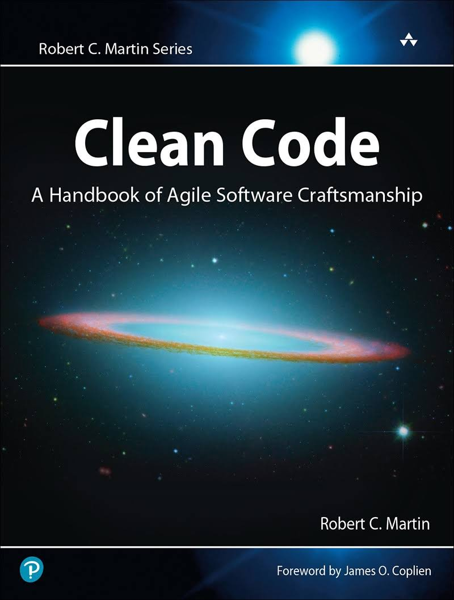

# Clean Code: A Handbook of Agile Software Craftsmanship

Author: Robert C. Martin

[Available here](https://www.amazon.com/Clean-Code-Handbook-Software-Craftsmanship/dp/0132350882)

# Ch1. Clean Code
> "Most managers want good code, even when they are obsessing about the schedule (...) It's *your* job to defend the code with equal passion"

- Clean code is *focused*: each function, each class, each module exposes a single-minded attitude that remains entirely undistracted, and upolluted, by the surrounding details
- Code, without tests, is not clean. No matter how elegant it is, no matter how readable and accessible, if it hath not tests, it be unclean
- You will read it, and it will be pretty much what you expected. It will be obvious, simple, and compelling

## Reading vs. Writing
- The ratio of time spent reading vs. writing is well over 10:1
- We are constantly reading old code as part of the effort to write new code
- **We want the reading of code to be easy, even if it makes the writing harder**
- You cannot write code if you cannot read the surrounding code
- If you want to go fast, get done quickly, if you want your code to be easy to write, make it easy to read

# Ch2. Meaningful Names

## Use intention-revealing names
> Choosing good names takes time, but saves more than it takes. Take care with your names and change them when you find better ones

## Avoid disinformation
- Avoid leaving false clues that obscure the meaning of code
- Avoid words whose entrenched meanings vary from our intended meaning

## Make meaningful distinctions
If names must be different, then they should also mean something different

## Use pronounceable names
- Humans are good at words
- Words are, by definition, pronounceable

## Use searchable names
Single-letter names and numeric constants have a particular problem in that they are not easy to locate across a body of text

## Avoid encodings
Encoding type or scope information into names simply adds an extra burden of deciphering

## Avoid mental mapping
> Clarity is king

## Class names
- Classes and objects should have noun or noun phrase names
- A class name should not be a verb

## Method names
Methods should have verb or verb phrase names

## Don't be cute
- Choose clarity over entertainment value
- Say what you mean. Mean what you say

## Pick one word per concept
A consistent lexicon is a great boon to the programmers who must use your code

## Don't pun
Avoid using the same word for two purposes -> essentially a pun

## Use solution domain names
- People who read your code will be programmers
- Use CS terms, algorithm names, pattern names, math terms

## Use problem domain names
- Separate solution and problem domain concepts
- Code that has more to do with problem domain concepts should have names drawn from the problem domain

## Add meaningful context
Most names are not meaningful in and of themselves

## Don't add gratuitous context
- Shorter names are generally better than long ones, so long as they are clear
- Add no more context to a name than is necessary

> Choosing good names requires good descriptive skills and a shared cultural background. This is a teaching issue rather than a technical, business, or management issue

# Ch3. Functions
## Small
Functions should be small

### Blocks and Indenting
- Blocks within `if` statements, `else` statements, `while` statements should be on line long -> probably a function call
- Keep the enclosing function small, adds documentary value
- Functions should not be large enough to hold nested structures -> makes easier to read and understand

## Do one thing
> Functions should do one thing. They should do it well. They should do it only

- Reasons to write functions: decompose a larger concept (the name of the function) into a set of steps at the next level of abstraction
- Functions that do one thing cannot be divided into sections

## One level of abstraction per function
- Once details are mixed with essential concepts, more details tend to accrete within the function

### The Stepdown rule
- We want code to be read like a top-down narrative
- A set of TO paragraphs, each describing the current level of abstraction and referencing subsequent TO paragraphs at the next level down

## Use descriptive names
Ward's principle: *"You know you are working on clean code when each routine turns out to be pretty much what you expected"*

- Spend time choosing a name
- You should try several different names and read the code with each in place

## Function arguments
Ideal number of arguments for a function:
- zero (niladic)
- one (monadic)
- two (dyadic)
- more than that should be avoided where possible

- **Arguments are hard from a testing point of view** -> test cases for all combinations of arguments
- Output arguments are harder to understand than input arguments
- **Passing a boolean into a function (flag arguments) is a terrible practice** -> loudly proclaiming that this function does more than one thing -> does one thing if the flag is true and another if the flag is false!
- When a function seems to need more than two or three arguments, it is likely that some of those arguments ought to be wrapped into a class of their own -> When groups of variables are passed together, they are likely part of a concept that deserves a name of its own
- Side effects are lies -> your functions promises to do one thing, but it also does other *hidden* things
- Either your function should change the state of an object, or it should return some information about the object
- **Prefer Exceptions to returing error codes**
- Extract try/catch blocks into functions of their own
- Functions should do one thing -> error handling is one thing
- Don't repeat yourself -> duplication may be the root of all evil in software

## How do you write functions like this?
Writing software is like any other kind of writing
1. Get your thoughts down first
2. Massage it until it reads well

The first draft might be clumsy and disorganized, so you restructure it and refine it until it reads the way you want it to read

> Every system is built from a domain-specific language designed by the programmers to describe the system. Functions are the verbs of that language, and classes are the nouns.

# Ch4. Comments
- Comments are always failures. We must have them because we cannot always figure out how to express ourselves without them, but their use is not a cause for celebration
- Comments lie. Not always, and not intentionally, but too often
- The older a comment is, and the farther away it is from the code it describes, the more likely it is to be wrong
- **Truth can only be found in the code**
- Explain your intent in code: **create a function that says the same thing as the comment you want to write**
- A comment may be used to amplify the importance of something that may otherwise seem inconsequential
- We have good source code control systems now. Those systems will remember the code for us. We don’t have to comment it out any more. Just delete the code
- Short functions don't need much description -> well-chosen name for a small function that does one thing is better than a comment header

# Ch5. Formatting
Code formatting
- Too important to ignore
- Is about communication -> developer's first order of business

> Small files are easier to understand than large files are

## The newspaper metaphor
Source file should be like a newspaper article
- Name should be simple but explanatory
- The name, by itself, should be sufficient to tell us whether we are in the right module or not

## Vertical formatting
- Avoid forcing the reader to hop around through the source files and classes
- **Dependent functions**: if one function calls another, they should be vertically close, and the caller should be above the callee

## Horizontal formatting
- Strive to keep your lines short
- Beyond 100~120 isn't advisable

# Ch6. Objects and Data Structures

# Ch7. Error Handling

# Ch8. Boundaries

# Ch9. Unit Tests

# Ch10. Classes

# Ch11. Systems

# Ch12. Emergence

# Ch13. Concurrency

# Ch14. Successive Refinement
