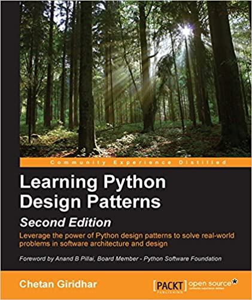

# Learning Python Design Patterns

Author: Chetan Giridhar

[Available here](https://www.amazon.com/Learning-Python-Design-Patterns-Second-ebook/dp/B018XYKNOM)

# Ch1. Introduction to design patterns

## Understanding object-oriented programming
- Concept of *objects* that have attributes (data members) and procedures (member functions)
- Procedures are responsible for manipulating the attributes
- Objects, which are instances of classes, interact among each other to serve the purpose of an application under development

### Classes
- Define objects in attributes and behaviors (methods)
- Classes consist of constructors that provide the initial state for these objects
- Are like templates and hence can be easily reused

### Methods
- Represent the behavior of the object
- Work on attributes and also implement the desired functionality

## Major aspects of OOP

### Encapsulation
- An object's behavior is kept hidden from the outside world or objects keep their state information private
- Clients can't change the object's internal state by directly acting on them
- Clients request the object by sending requests. Based on the type, objects may respond by changing their internal state using special member functions such as `get` and `set`

### Polymorphism
- Can be of two types:
  - An object provides different implementations of the method based on input parameters
  - The same interface can be used by objects of different types
- In Python polymorphism is a feature built-in for the language (e.g. + operator)

### Inheritance
- Indicates that one class derives (most of) its functionality from the parent class
- An option to reuse functionality defined in the base class and allow independent extensions of the original software implementation
- Creates hierarchy via the relationships among objects of different classes 
- Python supports multiple inheritance (multiple base classes)

### Abstraction
- Provides a simple interface to the clients. Clients can interact with class objects and call methods defined in the interface
- Abstracts the complexity of internal classes with an interface so that the client need not be aware of internal implementations

### Composition
- Combine objects or classes into more complex data structures or software implementations
- An object is used to call member functions in other modules thereby making base functionality available across modules without inheritance

## Object-oriented design principles

### The open/close principle
> **Classes or objects and methods should be open for extension but closed for modifications**

- Make sure you write your classes or modules in a generic way
- Existing classes are not changed reducing the chances of regression
- Helps maintain backward compatibility

### The inversion of control principle
> **High-level modules shouldn't be dependent on low-level modules; they should be dependent on abstractions. Details should depend on abstractions and not the other way round**

- The base module and dependent module should be decoupled with an abstraction layer in between
- The details of your class should represent the abstractions
- The tight coupling of modules is no more prevalent and hence no complexity/rigidity in the system
- Easy to deal with dependencies across modules in a better way

### The interface segregation principle
> **Clients should not be force to depend on interfaces they don't use**

- Forces developers to write thin interfaces and have methods that are specific to the interface
- Helps you not to populate interfaces by adding unintentional methods

### The single responsibility principle
> **A class should have only one reason to change**

- If a class is taking care of two functionalities, it is better to split them
- Functionality = a reason to change
- Whenever there is a change in one functionality, this particular class needs to change, and nothing else
- If a class has multiple functionalities, the dependent classes will have to undergo changes for multiple reasons, which gets avoided

### The substitution principle
> **Derived classes must be able to completely substitute the base classes**

## The concept of design patterns
- Solutions to given problems
- Design patterns are discoveries and not a invention in themselves
- Is about learning from others' successes rather than your own failures!

### Advantages of design patterns
- Reusable across multiple projects
- Architectural level of problems can be solved
- Time-tested and well-proven, which is the experience of developers and architects
- They have reliability and dependence

### Patterns for dynamic languages
Python:
- Types or classes are objects at runtime
- Variables can have type as a value and can be modified at runtime
- Dynamic languages have more flexibility in terms of class restrictions
- Everything is public by default
- Design patterns can be easily implemented in dynamic languages

## Classifying patterns
- Creational
- Structural
- Behavioral

> Classification of patterns is done based primarily on how the objects get created, how classes and objects are structured in a software application, and also covers the way objects interact among themselves

### Creational patterns
- Work on the basis of how objects can be created
- Isolate the details of object creation
- Code is independent of the type of object to be created

### Structural patterns
- Design the structure of objects and classes so that they can compose to achieve larger results
- Focus on simplifying the structure and identifying the relationship between classes and objects
- Focus on class inheritance and composition

### Behavioral patterns
- Concerned with the interaction among objects and responsibilities of objects
- Objects should be able to interact and still be loosely coupled

# Ch2. The singleton design pattern
- Typically used in logging or database operations, printer spoolers, thread pools, caches, dialog boxes, registry settings, and so on
- Ensure that only one object of the class gets created
- Provide an access point for an object that is global to the program
- Control concurrent access to resources that are shared
- Make the constructor private and create a static method that does the object initialization
- Override the `__new__` method (Python's special method to instantiate objects) to control the object creation
- Another use case: **lazy instantiation**. Makes sure that the object gets created when it's actually needed
- All modules are Singletons by default because of Python's importing behavior

## Monostate Singleton pattern
- All objects share the same state
- Assign the `__dict__` variable with the `__shared_state` class variable. Python uses `__dict__` to store the state of every object of a class

## Singletons and metaclasses
- A metaclass is a class of a class
- The class is an instance of its metaclass
- Programmers get an opportunity to create classes of their own type from the predefined Python classes

## Drawbacks
- Singletons have a global point of access
- Al classes that are dependent on global variables get tightly coupled as a change to the global data by one class can inadvertently impact the other class

# Ch3. The factory pattern - building factories to create objects

## Understanding the factory pattern
- Factory = a class that is responsible for creating objects of other types
- The class that acts as a factory has an object and methods associated with it
- The client calls this method with certain parameters; objects of desired types are created in turn and returned to the client by the factory

**Advantages**
- Loose coupling: object creation can be independent of the class implementation
- The client only needs to know the interface, methods, and parameters that need to be passed to create objects of the desired type (simplifies implementations for the client)
- Adding another class to the factory to create objects of another type can be easily done without the client changing the code

## The simple factory pattern
- Not a pattern in itself
- Helps create objects of different types rather than direct object instantiation

## The factory method pattern
- We define an interface to create objects, but instead of the factory being responsible for the object creation, the responsibility is deferred to the subclass that decides the class to be instantiated
- Creation is through inheritance and not through instantiation
- Makes the design more customizable. It can return the same instance or subclass rather than an object of a certain type

> The factory method pattern defines an interface to create an object, but defers the decision ON which class to instantiate to its subclasses

**Advantages**
- Makes the code generic and flexible, not being tied to a certain class for instantiation. We're dependent on the interface (Product) and not on the ConcreteProduct class
- Loose coupling: the code that creates the object is separate from the code that uses it
- The client don't need to bother about what argument to pass and which class to instantiate -> the addition of new classes is easy and involves low maintenance

## The abstract factory pattern

> Provide an interface to create families of related objects without specifying the concrete class

- Makes sure that the client is isolated from the creation of objects but allowed to use the objects created

## Factory method versus abstract factory method

|                       **Factory method**                       |                          **Abstract Factory method**                           |
| :------------------------------------------------------------: | :----------------------------------------------------------------------------: |
|      Exposes a method to the client to create the objects      |             Contains one or more factory methods of another class              |
| Uses inheritance and subclass to decide which object to create | Uses composition to delegate responsibility to create objects of another class |
|                 Is used to create one product                  |                 Is about creating families of related products                 |

# Ch4. The façade pattern - being adaptive with façade

## Understanding Structural design patterns
- Describe how objects and classes can be combined to form larger structures. Structural patterns are a combination of class and object patterns
- Ease the design by identifying simpler ways to realize or demonstrate relationships between entities
- Class patterns: describe abstraction with the help of inheritance and provide a more useful program interface
- Object patterns: describe how objects can be associated and composed to form larger objects

## Understanding the Façade design pattern
> Façade hides the complexities of the internal system and provides an interface to the client that can access the system in a very simplified way

- Provides an unified interface to a set of interfaces in a subsystem and defines a high-level interface that helps the client use the subsystem in an easy way
- Discusses representing a complex subsystem with a single interface object -> it doesn't encapsulate the subsystem, but actually combines the underlying subsystems
- Promotes the decoupling of the implementation with multiple clients

## Main participants
- **Façade**: wrap up a complex group of subsystems so that it can provide a pleasing look to the outside world
- **System**: represents a set of varied subsystems that make the whole system compound and difficult to view or work with
- **Client**: interact with the façade so that it can easily communicate with the subsystem and get the work completed (doesn't have to bother about the complex nature of the system)

## The principle of least knowledge
- Design principle behind Façade pattern
- Reduce the interactions between objects to just a few friend that are close enough to you

## The Law of Demeter
- Design guideline:
  - Each unit should have only limited knowledge of other units of the system
  - A unit should talk to its friends only
  - A unit should not know about the internal details of the object that it manipulates

> The principle of least knowledge and Law of Demeter are the same and both point to the philosophy of *loose coupling*

# Ch5. The proxy pattern - controlling object access
> Proxy: a system that intermediates between the seeker and provider. Seeker is the one that makes the request, and provider delivers the resources in response to the request

- A proxy server encapsulates requests, enables privacy, and works well in distributed architectures
- Proxy is a wrapper or agent object that wraps the real serving object
- Provide a surrogate or placeholder for another object in order to control access to a real object
- Some useful scenarios:
  - Represents a complex system in a simpler way
  - Acts as a shield against malicious intentions and protect the real object
  - Provides a local interface for remote objects on different servers
  - Provides a light handle for a higher memory-consuming object

## Data Structure components
- **Proxy**
- **Subject/RealSubject**
- **Client**

## Different types of proxies
- **Virtual proxy**: placeholder for objects that are very heavy to instantiate
- **Remote proxy**: provides a local representation of a real object that resides on a remote server or different address space
- **Protective proxy**: controls access to the sensitive matter object of `RealSubject`
- **Smart proxy**: interposes additional actions when an object is accessed

| Proxy                                                                                                     | Façade                                                          |
| --------------------------------------------------------------------------------------------------------- | --------------------------------------------------------------- |
| Provides you with a surrogate or placeholder for another object to control access to it                   | Provides you with an interface to large subsystems of classes   |
| A Proxy object has the same interface as that of the target object and holds references to target objects | Minimizes the communication and dependencies between subsystems |
| Acts as an intermediary between the client and object that is wrapped                                     | Provides a single simplified interface                          |

### Decorator vs Proxy
- Decorator adds behavior to the object that it decorates at runtime
- Proxy controls access to an object

### Disadvantages
- Proxy pattern can increase the response time

# Ch6. The observer pattern - keeping objects in the know

## Behavioral patterns
- Focus on the responsibilities that an object has
- Deal with the interaction among objects to achieve larger functionality
- Objects should be able to interact with each other, **but they should still be loosely coupled**

## Understanding the observer design pattern
> An object (Subject) maintains a list of dependents (Observers) so that the Subject can notify all the Observers about the changes that it undergoes using any of the methods defined by the Observer

- Defines a one-to-many dependency between objects so that any change in one object will be notified to the other dependent objects automatically
- Encapsulates the core component of the Subject

## The pull model
- Subject broadcasts to all the registered Observers when there is any change
- Observer is responsible for getting the changes or pulling data from the subscriber when there is an amendment
- Pull model is **ineffective**: involves two steps:
  - Subject notifies the Observer
  - Observer pulls the required data from the Subject

## The push model
- Changes are pushed by the Subject to the Observer
- Subject can send detailed information to the Observer (even though it may not be needed) -> can result in sluggish response times when a large amount of data in sent by the Subject but is never actually used by the Observer

## Loose coupling and the observer pattern
- Coupling refers to the degree of knowledge that one object has about the other object that it interacts with

> Loosely-coupled designs allow us to build flexbile object-oriented systems that can handle changes because they reduce the dependency between multiple objects

- Reduces the risk that a change made within one element might create an unanticipated impact on the other elements
- Simplifies testing, maintenance, and troubleshooting problems
- System can be easily broken down into definable elements

# Ch7. The command pattern - encapsulating invocation