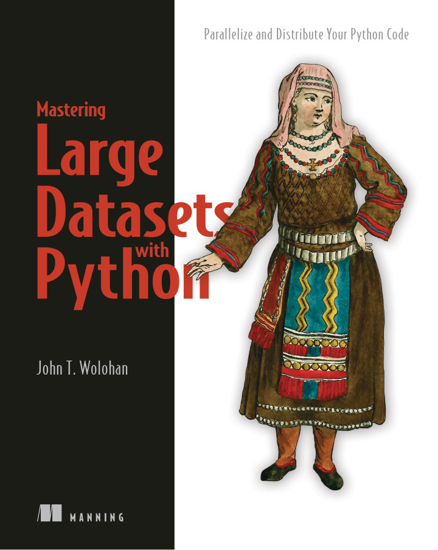
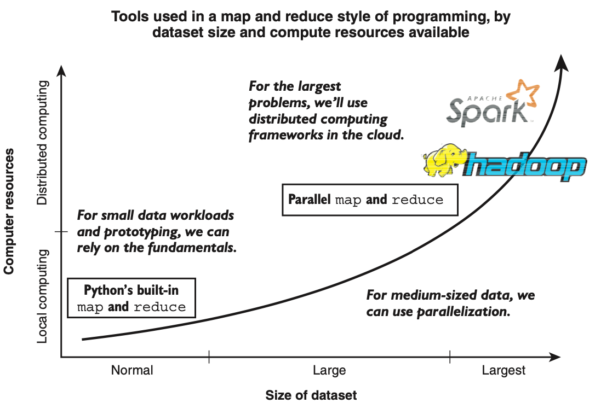

# Mastering Large Datasets with Python: Parallelize and Distribute Your Python Code

Authors: John T. Wolohan

[Available here](https://www.manning.com/books/mastering-large-datasets-with-python)



# Ch1. Introduction
Map and reduce style of programming:
- easily write parallel programs
- organize the code around two functions: `map` and `reduce`

> `MapReduce` = framework for parallel and distributed computing; `map` and `reduce` = style of programming that allows running the work in parallel with minimal rewriting and extend the work to distributed workflows

**Dask** -> another tool for managing large data without `map` and `reduce`

## Procedural programming
Program Workflow
1. Starts to run
2. issues an instruction
3. instruction is executed
4. repeat 2 and 3
5. finishes running

## Parallel programming
Program workflow
1. Starts to run
2. divides up the work into chunks of instructions and data
3. each chunk of work is executed independently
4. chunks of work are reassembled
5. finishes running



> The `map` and `reduce` style is applicable everywhere, but its specific strengths are in areas where you may need to scale

## The map function for transforming data
- `map`: function to transform sequences of data from one type to another
- Always retains the same number of objects in the output as were provided in the input
- performs one-to-one transformations -> is a great way to transform data so it is more suitable for use

> Declarative programming: focuses on explaining the logic of the code and not on specifying low-level details -> scaling is natural, the logic stays the same

## The reduce function for advanced transformations
- `reduce`: transform a sequence of data into a data structure of any shape or size
- MapReduce programming pattern relies on the `map` function to transform some data into another type of data and then uses the `reduce` function to combine that data
- performs one-to-any transformations -> is a great way to assemble data into a final result

## Distributed computing for speed and scale
Extension of parallel computing in which the computer resource we are dedicating to work on each chunk of a given task is its own machine

## Hadoop: A distributed framework for map and reduce
- Designed as an open source implementation of Google's original MapReduce framework
- Evolved into distributed computing software used widely by companies processing large amounts of data

## Spark for high-powered map, reduce, and more
- Something of a sucessor to the Apache Hadoop framework that does more of its work in memory instead of by writing to file
- Can run more than 100x faster than Hadoop

## AWS Elastic MapReduce (EMR) - Large datasets in the cloud
- Popular way to implement Hadoop and Spark
- tackle small problems with parallel programming as its cost effective
- tackle large problems with parallel programming because we can procure as many resources as we need

# Ch2. Accelerating large dataset work: Map and parallel computing
`map`'s primary capabilities:
- Replace `for` loops
- Transform data
- `map` evaluates only when necessary, not when called -> generic `map` object as output

`map` makes easy to parallel code -> break into pieces

## Pattern
- Take a sequence of data
- Transform it with a function
- Get the outputs

> `Generators` instead of normal loops prevents storing all objects in memory in advance

## Lazy functions for large datasets
- `map` = lazy function = it doesn't evaluate when we call `map`
- Python stores the instructions for evaluating the function and runs them at the exact moment we ask for the value
- Common lazy objects in Python = `range` function
- Lazy `map` allows us to transform a lot of data without an unnecessarily large amount of memory or spending the time to generate it

## Parallel processing
### Problems
#### Inability to pickle data or functions 
- *Pickling*: Python's version of object serialization or mashalling
- Storing objects from our code in an efficient binary format on the disk that can be read back by our program at a later time (`pickle` module) 
- allows us to share data across procesors or even machines, saving the instructions and data and then executing them elsewhere
- Objects we can't pickle: lambda functions, nested functions, nested classes
- `pathos` and `dill` module allows us to pickle almost anything

#### Order-sensitive operations
- Work in parallel: not guaranteed that tasks will be finished in the same order they're input
- If work needs to be processed in a linear order -> probably shouldn't do it in parallel
- Even though Python may not complete the problems in order, it still remembers the order in which it was supposed to do them -> `map` returns in the exact order we would expect, even if it doesn't process in that order

#### State-dependent operations
- Common solution for the state problem: **take the internal state and make it an external variable**

## Other observations
- Best way to flatten a list into one big list -> Python's itertools `chain` function: takes an iterable of iterables and chains them together so they can all be accessed one after another -> lazy by default
- Best way to visualize graphs is to take it out of Python and import it into Gephi: dedicated piece of graph visualization software

> Anytime we're converting a sequence of some type into a sequence of another type, what we're doing can be expressed as a map -> N-to-N transformation: we're converting N data elements, into N data elements but in different format

- To make this type of problem parallel only adds up to few lines of code:
  - one import
  - wrangling our processors with `Pool()`
  - modifying our `map` statements to use `Pool.map` method

# Ch3. Function pipelines for mapping complex transformations

## Helper functions and function chains
**Helper functions**: small, simple functions that we rely on to do complex things -> break down large problems into small pieces that we can code quickly

**Function chains** or **pipelines**: the way we put helper functions to work

### Creating a pipeline
- Chaining helper functions together
- Ways to do this:
  - Using a sequence of maps
  - Chaining functions together with `compose`
  - Creating a function pipeline with `pipe`
- `compose` and `pipe` are functions in the `toolz` package

#### Compose
```
from toolz.functoolz import compose
```

- Pass `compose` all the functions we want to include in our pipeline
- Pass in **reverse order** because `compose` is going to apply them backwards
- Store the output of our `compose` function, which is itself a function, to a variable
- Call that variable or pass it along to `map`

#### Pipe
```
from toolz.functoolz import pipe
```

- `pipe` function will pass a value through a pipeline
- `pipe` expects the functions to be in the order we want to apply them
- `pipe` evaluates each of the functions and returns a results
- If we want to pass it to `map`, we have to wrap it in a function definition

## Summary
> Major advantages of creating pipelines of helper functions are that the code becomes: **Readable and clear; Modular and easy to edit**

- Modular code play very nice with `map` and can readily move into parallel workflows, such as by using the `Pool()`
- We can simplify working with nested data structures by using nested function pipelines, which we can apply with `map`

# Ch4. Processing large datasets with lazy workflows
## Laziness
- *Lazy evaluation*: strategy when deciding when to perform computations
- Under lazy evaluation, the Python interpreter executes lazy Python code only when the program needs the results of that code
- Opposite of *eager evaluation*, where everything is evaluated when it's called

### Shrinking sequences with the filter function
- `filter`: function for pruning sequences. 
- Takes a sequence and restricts it to only the elements that meet a given condition
- Related functions to know
  - `itertools.filterfalse`: get all the results that make a qualifier function return `False`
  - `toolz.dicttoolz.keyfilter`: filter on the keys of a `dict`
  - `toolz.dicttoolz.valfilter`: filter on the values of a `dict`
  - `toolz.dicttoolz.itemfilter`: filter on both the keys and the values of a dict

### Combining sequences with zip
- `zip`: function for merging sequences. 
- Takes two sequences and returns a single sequence of `tuples`, each of which contains an element from each of the original sequences
- Behaves like a zipper, it interlocks the values of Python iterables

### Lazy file searching with iglob
- `iglob`: function for lazily reading from the filesystem. 
- Lazy way of querying our filesystem
- Find a sequence of files on our filesystem that match a given pattern

```
from glob import iglob
posts = iglob("path/to/posts/2020/06/*.md")
```

## Understanding iterators: the magic behind lazy Python
- Replace data with instructions about where to find data and replace transformations with instructions for how to execute those transformations. 
- The computer only has to concern itself with the data it is processing right now, as opposed to the data it just processed or has to process in the future
- Iterators are the base class of all the Python data types that can be iterated over

> The iteration process is defined by a special method called `.__iter__()`. If a class has this method and returns an object with a `.__next__()` method, then we can iterate over it.

- One-way streets: once we call `next`, the item returned is removed from the sequence. We can never back up or retrieve that item again
- Not meant for by-hand inspection -> meant for processing big data

## Generators: functions for creating data
- Class of functions in Python that lazily produce values in a sequence
- We can create generators with functions using `yield` statements or through concise and powerful list comprehension-like generator expressions
- They're a simple way of implementing an iterator
- Primary advantage of generators and lazy functions: **avoiding storing more in memory than we need to**
- `itertools.islice`: take chunks from a sequence

> Lazy functions are great at processing data, but hardware still limits how quickly we can work through it

- `toolz.frequencies`: takes a sequence in and returns a `dict` of items that occurred in the sequence as keys with corresponding values equal to the number of times they occurred -> provides the frequencies of items in our sequence

## Simulations
- For simulations -> writing classes allow us to consolidate the data about each piece of the simulation
- `itertools.count()`: returns a generator that produces an infinite sequence of increasing numbers
- Unzipping = the opposite of zipping -> takes a single sequence and returns two -> unzip = `zip(*my_sequence)`

> `operator.methodcaller`: takes a string and returns a function that calls that method with the name of that string on any object passed to it -> call class methods using functions is helpful = allows us to use functions like `map` and `filter` on them

# Ch5. Accumulation operations with reduce
- `reduce`: function for N-to-X transformations
- We have a sequence and want to transform it into something that we can't use `map` for
- `map` can take care of the transformations in a very concise manner, whereas `reduce` can take care of the very final transformation

## Three parts of reduce
- **Accumulator function**
- **Sequence**: object that we can iterate through, such as lists, strings, and generators
- **Initializer**: initial value to be passed to our accumulator (may be *optional*) -> use an initalizer not when we want to change the value of our data, but when we want to change the *type* of the data

```
from functools import reduce

reduce(acc_fn, sequence, initializer)
```

### Accumulator functions
- Does the heavy lifting for `reduce`
- Special type of helper function
- Common prototype:
  - take an accumulated value and the next element in the sequence
  - return another object, typically of the same type as the accumulated value
  - **accumulator functions always needs to return a value**
- Accumulator functions take two variables: one for the accumulated data (often designated as acc, left, or a), and one for the next element in the sequence (designated nxt, right, or b).

```
def my_add(acc, nxt):
    return acc + nxt

# or, using lambda functions
lambda acc, nxt: acc + nxt
```

## Reductions
- `filter`
- `frequencies`

## Using map and reduce together
> If you can decompose a problem into an N-to-X transformation, all that stands between you and a reduction that solves that problem is a well-crafted accumulation function

- Using `map` and `reduce` pattern to decouple the transformation logic from the actual transformation itself:
  - leads to highly reusable code
  - with large datasets -> simple functions becomes paramount -> we may have to wait a long time to discover we made a small error

## Speeding up map and reduce
> Using a parallel map can counterintuitively be slower than using a lazy map in map an reduce scenarios

- We can always use parallelization at the `reduce` level instead of at the `map` level

# Ch6. Speeding up map and reduce with advanced parallelization
- Parallel `reduce`: use parallelization in the accumulation process instead of the transformation process

## Getting the most out of parallel map
Parallel `map` will be slower than lazy `map` when:
- we're going to iterate through the sequence a second time later in our workflow
- size of the work done in each parallel instance is small compared to the overhead that parallelization imposes -> *chunksize*: size of the different pieces into which we break our tasks for parallel processing
- Python makes *chunksize* available as an option -> vary according to the task at hand

### More parallel maps: `.imap` and `starmap`
#### `.imap`
- `.imap`: for lazy parallel mapping
- use `.imap` method to work in parallel on very large sequences efficiently
- Lazy and parallel? use the `.imap` and `.imap_unordered` methods of `Pool()` -> both methods return iterators instead of lists
- `.imap_unordered`: behaves the same, except it doesn't necessarily put the sequence in the right order for our iterator

#### `starmap`
- use `starmap` to work with complex iterables, especially those we're likely to create using the `zip` function -> more than one single parameter (map's limitation)
- `starmap` unpacks `tuples` as **positional parameters** to the function with which we're mapping
- `itertools.starmap`: lazy function
- `Pool().starmap`: parallel function

## Parallel reduce for faster reductions
Parallel `reduce`:
- break a problem into chunks
- make no guarantees about order
- need to pickle data
- be finicky about stateful objects
- run slower than its linear counterpart on small datasets
- run faster than its linear counterpart on big datasets
- require an accumulator function, some data, and an initial value
- perform N-to-X transformations

> Parallel reduce has six parameters: an accumulation function, a sequence, an initializer value, a map, a chunksize, and a combination function - three more than the standard reduce function

Parallel `reduce` workflow:
- break our problem into pieces
- do some work
- combine the work
- return a result

> With parallel `reduce` we trade the simplicity of always having the same combination function for the flexibility of more possible transformations

Implementing parallel `reduce`:
1. Importing the proper classes and functions
2. Rounding up some processors
3. Passing our `reduce` function the right helper functions and variables

- Python doesn't natively support parallel `reduce` -> `pathos` library
- `toolz.fold` -> parallel `reduce` implementation

> `toolz` library: functional utility library that Python never came with. High-performance version of the library = `CyToolz`

# Ch7. Processing truly big datasets with Hadoop and Spark
- **Hadoop**: set of tools that support distributed map and reduce style of programming through Hadoop MapReduce
- **Spark**: analytics toolkit designed to modernize Hadoop

## Distributed computing
- share tasks and data long-term across a network of computers
- offers large benefits in speed when we can parallelize our work
- challenges:
  - keeping track of all our data
  - coordinating our work
  
> If we distribute our work prematurely, we’ll end up losing performance spending too much time talking between computers and processors. A lot of performance improvements at the high-performance limits of distributed computing revolve around **optimizing communication between machines**

## Hadoop five modules
1. *MapReduce*: way of dividing work into parallelizable chunks
2. *YARN*: scheduler and resource manager
3. *HDFS*: file system for Hadoop
4. *Ozone*: Hadoop extension for object storage and semantic computing
5. *Common*: set of utilities that are shared across the previous four modules

### YARN for job scheduling
- Scheduling
  - Oversees all of the work that is being done
  - Acts as a final decision maker in terms of how resources should be allocated across the cluster
- Application management (*node managers*): work at the node (single-machine) level to determine how resources should be allocated within that machine
  - *federation*: tie together resource managers in extremely high demand use cases where thousands of nodes are not sufficient

### The data storage backbone of Hadoop: HDFS
Hadoop Distributed File System (HDFS) -> reliable, performant foundation for high-performance distributed computing (but with that comes complexity). Use cases:
- process big datasets
- be flexible in hardware choice
- be protected against hardware failure

> Moving code is faster than moving data

### MapReduce jobs using Python and Hadoop Streaming
Hadoop MapReduce with Python -> Hadoop Streaming = utility for using Hadoop MapReduce with programming languages besides Java

Hadoop natively supports compression data: .gz, .bz2, and .snappy

## Spark for interactive workflows
Analytics-oriented data processing framework designed to take advantage of higher-RAM compute clusters. Advantages for Python programmers:
- direct Python interface - `PySpark`: allows for us to interactively explore big data through a PySpark shell REPL
- can query SQL databases directly (Java Database Connectivity - JDBC)
- has a *DataFrame* API: rows-and-columns data structure familiar to `pandas` -> provides a convenience layer on top of the core Spark data object: the RDD (Resilient Distributed Dataset)
- Spark has two high-performance data structures: RDDs, which are excellent for any type of data, and DataFrames, which are optimized for tabular data.

Favor Spark over Hadoop when:
- processing streaming data
- need to get the task completed nearly instantaneously
- willing to pay for high-RAM compute clusters

### PySpark for mixing Python and Spark
PySpark: we can call Spark's Scala methods through Python just like we would a normal Python library

# Ch8. Best practices for large data with Apache Streaming and mrjob
Use Hadoop to process
- lots of data fast: distributed parallelization
- data that's important: low data loss
- enormous amounts of data: petabyte scale

Drawbacks
- To use Hadoop with Python -> Hadoop Streaming utility
- Repeatedly read in string from `stdin`
- Error messages for Java are not helpful

## Unstructured data: Logs and documents
- Hadoop creators designed Hadoop to work on *unstructured data* -> data in the form of documents
- Unstructured data is notoriously unwieldly =/= tabular data
- But, is one of the most common forms of data around

## JSON for passing data between mapper and reducer
- JavaScript Object Notation (JSON)
- Data format used for moving data in plain text between one place and another
- `json.dumps()` and `json.loads()` functions from Python's json library to achieve the transfer
- Advantages:
  - easy for humans and machines to read
  - provides a number of useful basic data types (string, numeric, array)
  - emphasis on key-value pairs that aids the loose coupling of systems

## mrjob for pythonic Hadoop streaming
- `mrjob`: Python library for Hadoop Streaming that focuses on cloud compatibility for truly scalable analysis
- keeps the mapper and reducer steps but wraps them up in a single worker class named `mrjob`
- `mrjob` versions of `map` and `reduce` share the same type signature, taking in keys and values and outputting keys and values
- `mrjob` enforces JSON data exchange between the mapper and reducer phases, so we need to ensure that our output data is JSON serializable.

# Ch9. PageRank with map and reduce in PySpark
PySpark's RDD class methods:
- `map`-like methods: replicate the function of `map`
- `reduce`-like methods: replicate the function of `reduce`
- *Convenience methods*: solve common problems

> **Partitions** are the abstraction that RDDs use to implement parallelization. The data in an RDD is split up across different partitions, and each partition is handled in memory. It is common in large data tasks to partition an RDD by a key

### Map-like methods in PySpark
- `.map`
- `.flatMap`
- `.mapValues`
- `.flatMapValues`
- `. mapPartitions`
- `.mapPartitionsWithIndex`

### Reduce-like methods in PySpark
- `.reduce`
- `.fold`
- `.aggregate` -> provides all the functionality of a parallel reduce. We can provide an initializer value, an aggregation function, and a combination function

### Convenience methods in PySpark
Many of these mirror functions in `functools`, `itertools` and `toolz`. Some examples:
- .countByKey()
- .countByValue()
- .distinct()
- .countApproxDistinct() 
- .filter()
- .first()
- .groupBy()
- .groupByKey()
- .saveAsTextFile()
- .take()

#### Saving RDDs to text files
Excellent for a few reasons:
- The data is in a human-readable, persistent format.
- We can easily read this data back into Spark with the `.textFile` method of `SparkContext`.
- The data is well structured for other parallel tools, such as Hadoop’s MapReduce.
- We can specify a compression format for efficient data storage or transfer.

> RDD `.aggregate` method—returns a dict. We need an RDD so that we can take advantage of Spark’s parallelization. To get an RDD, we’ll need to explicitly convert the items of that dict into an RDD using the `.parallelize` method from our SparkContext: `sc`.

- Spark programs often use \ characters in their method chaining to increase their readability
- Using the `byKey` variations of methods in PySpark often results in significant speed-ups because like data is worked on by the same distributed compute worker

# Ch10. Faster decision-making with machine learning and PySpark